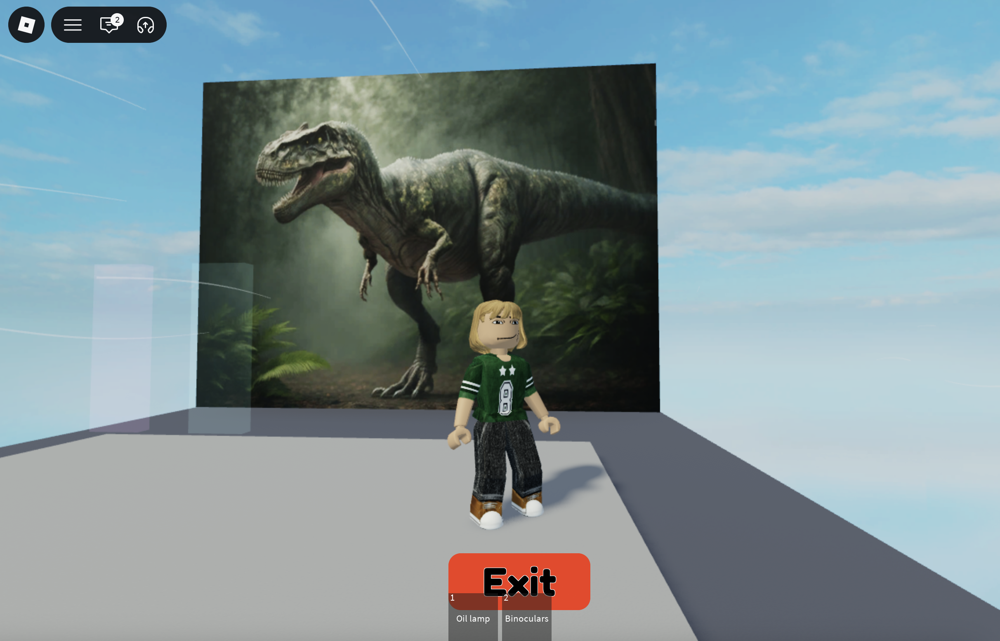
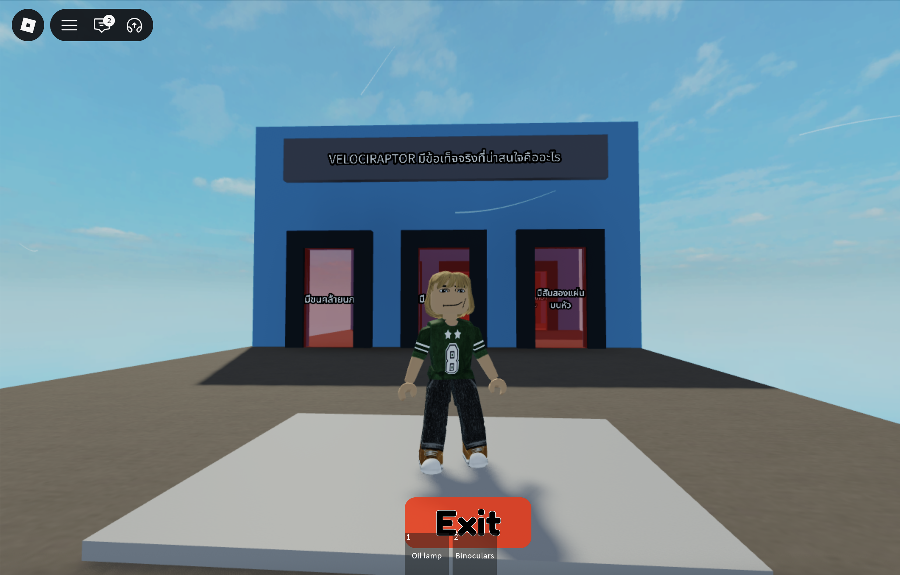

# 🦕 Roblox Dinosaur Educational & Exploration Game (Group Project)

Welcome to our Roblox game project! This is an interactive educational and exploration-based game designed to test players' knowledge about dinosaurs and their prehistoric eras. Players navigate through various stages, discover dinosaur facts, solve quizzes, and clear stages to achieve victory!

## 🎮 Play the Game
Experience and test your dinosaur knowledge directly on Roblox here:
👉 **[Click here to play on Roblox](https://www.roblox.com/share?code=d624e65d29787e49913f1a19e629ad12&type=ExperienceDetails&stamp=1782837558628)**

---

## 📸 In-Game Screenshots (ภาพบรรยากาศในเกม)

### 1. Exploration Zone (โซนสำรวจให้ความรู้)
เดินสำรวจพื้นที่จำลองและศึกษาข้อมูลของไดโนเสาร์ในแต่ละยุค
 

### 2. Stage 1: Text-Based Quiz (ด่านที่ 1: พิมพ์คำตอบ)
ท้าทายความรู้ด้วยด่านตอบคำถาม โดยผู้เล่นจะต้องพิมพ์คำตอบที่ถูกต้องลงในระบบเพื่อผ่านทาง
 

### 3. Stage 2: Gate Selection Quiz (ด่านที่ 2: เลือกช่องประตูตอบ)
ด่านวัดใจ! ผู้เล่นจะต้องเลือกเดินเข้าช่องประตูที่เป็นคำตอบที่ถูกต้องเพื่อผ่านไปด่านต่อไป
 

---

## 🚀 Key Features & Gameplay Mechanics (ระบบเด่นของเกม)
* **Educational Exploration:** Walk through different zones to learn about prehistoric eras and dinosaur history.
* **Stage-Based Quizzes:** Solve dinosaur-related trivia questions (both text input and gate selection) to pass checkpoints.
* **Teleportation System:** Seamlessly teleports players to the next challenge area once a quiz is cleared.
* **Win Condition:** A straightforward, goal-oriented gameplay loop—answer correctly, clear all stages, and win the game!

## 🛠️ Tools & Technologies Used
* **Platform:** Roblox Studio
* **Language:** Luau (Roblox Luau Scripting)
* **Design Aspects:** Educational Game Design, Level Design, and Workflow Logic

---

## 📌 Project Limitations & Challenges (ข้อจำกัดและสิ่งที่เป็นโจทย์ท้าทาย)
During development, we aimed to implement advanced character rigging and custom animations for the dinosaurs. However, due to the tight project timeline and the high complexity of manual multi-joint bone rigging for each dinosaur model, the dinosaurs in this version remain static. 

We shifted our core focus to optimizing the educational logic, quiz mechanics, and user progression instead.
*(ภาษาไทย: ในช่วงพัฒนา คณะผู้จัดทำตั้งใจจะทำระบบอนิเมชันและการจัดกระดูกโครงสร้าง (Rigging) ให้ไดโนเสาร์ขยับได้ แต่เนื่องจากระยะเวลาที่จำกัดและขั้นตอนการจัดกระดูกทีละข้อมีความซับซ้อนสูงมาก ทำให้ในเวอร์ชันนี้ไดโนเสาร์จะยังไม่สามารถโต้ตอบได้ เราจึงเลือกที่จะมุ่งเน้นไปที่การพัฒนาโมดูลความรู้ ระบบตอบคำถาม และการผ่านด่านของเกมให้สมบูรณ์และลื่นไหลที่สุดแทน)
*
